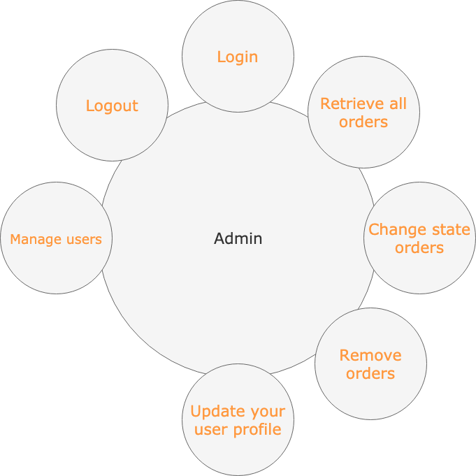
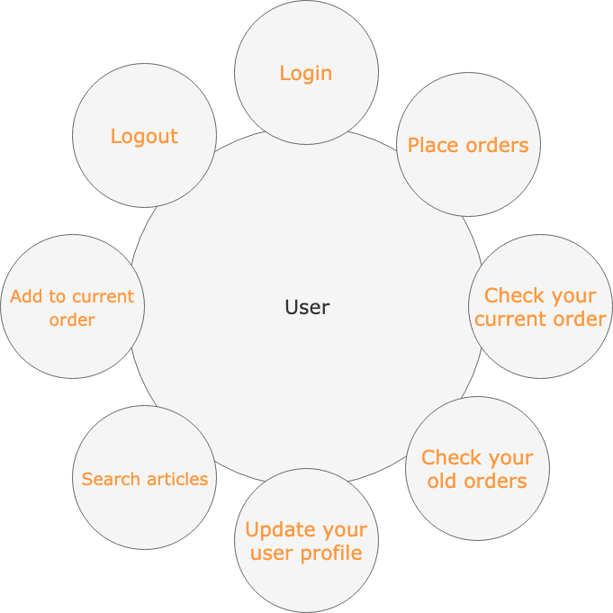
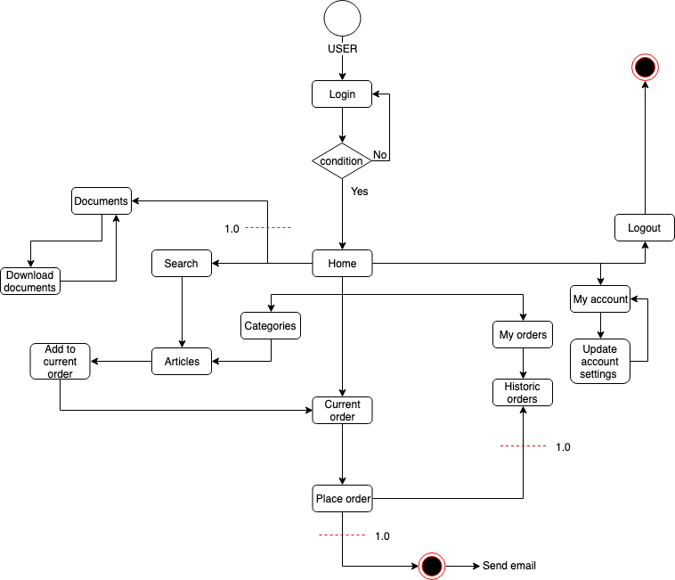
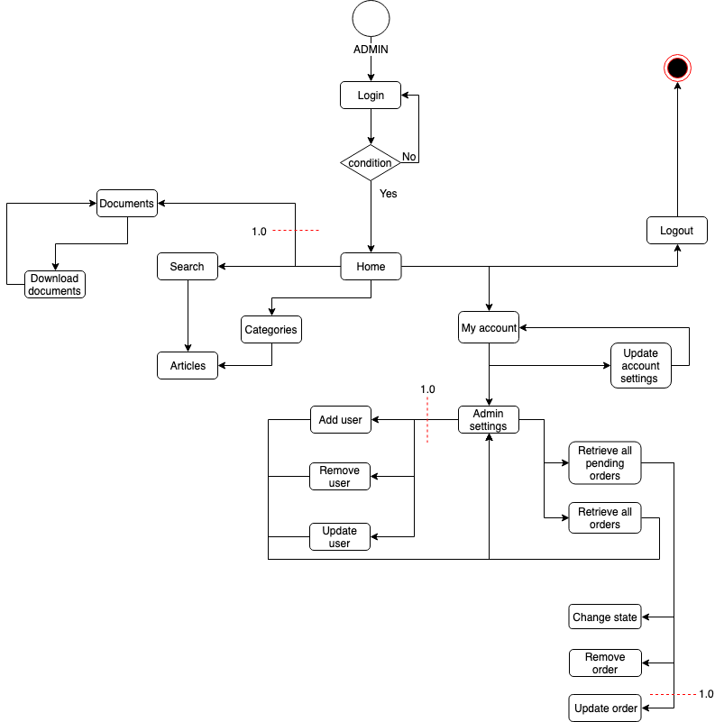
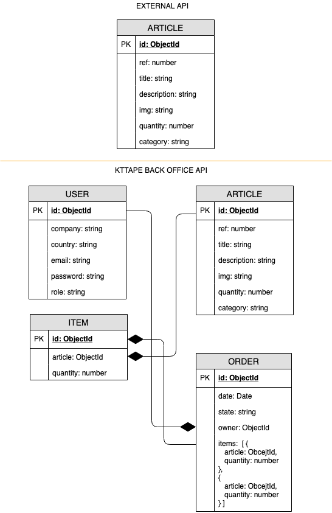

# KtTape Back Office
A project by:
    **Adrià Arquimbau Codina**

---

## **Introduction**
---
KtTape Back Office is a (single page / multi page)? with React to facilitate online ordering of brand products between national suppliers and the continental supplier.

## **Functional Description**
---
Admin can:

0.1
+ Check the order history of each supplier. 
+ Check current orders and be able to mark them as made or pending.
+ Add new supplier account.
+ Update your user profile
+ Have access to documentation of interest of the brand.

1.0

+ Add new articles
+ Remove articles
+ Update articles
+ Update / Remove suppliers

Users can:

0.1

+ Place online orders for each product with real stock.
+ Check your current order and the history of your old orders.
+ Update your user profile.
+ Have access to documentation of interest of the brand.

1.0

+ 
---

### Categories

KtTape Pro Precut
KtTape Pro Uncut
KtTape Pro Limited Edition
KtTape Pro Jumbo Precut
KtTape Pro Jumbo Uncut

KtTape Original Precut
KtTape Original Uncut
KtTape Original Jumbo Precut
KtTape Original Jumbo Uncut
KtTape Original Jumbo Edema

Other Products

---

### Use cases

#### Admin

#### User

### Flows

#### User

#### Admin

## **Technical Description**
---

### **Blocks**

### **Components**

### **React Components**

